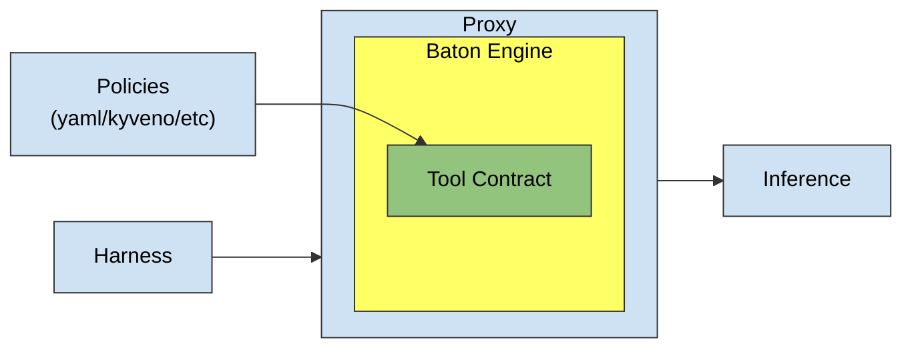

# Baton Spec v0

Baton is an information-flow policy engine for AI agents. It sits between the agent and its tools: every proposed tool call is checked before dispatch. It tracks where information came from and decides whether it may flow into tools and external recipients.

# Glossary

**Engine**: evaluates Policies against incoming Turns in a given Trajectory and owns policy registrations.

**Trajectory** – one agent run.

**Turn** - one piece of a *Trajectory* (user message, assistant message, or tool result). Every turn carries a *Label*.

**Label** - the product of *dimensions* describing a turn's information. The Trajectory label is the fold of all turn labels.

**Dimension** - one axis of a *Label*. Each dimension defines a **combine** operation, to describe how *Dimensions* fold across *turns*.

**Built-in dimensions:**

- **Trust**: trusted / suspicious / unknown. Combine keeps the worst evidence (min): suspicious dominates unknown, unknown dominates trusted.
- **Effects**: a set of {Mutation, Egress}, or unknown. Combine is union — an effect that happened stays in the trajectory.
- **Audience**: public / an explicit reader set / unknown. Combine is intersection: the result may be read only by those allowed to read every input.
- **Attention**\*: High/No (x + any = x) (neutral element)

**ToolContract** — a tool's annotation: Requirements the Trajectory's label must satisfy before the call and a declared output label - How this tool execution changes the current Trajectory Label.

**Authority** - A way to relax the Label to allow a tool call.

**Transformer** - A registered function that derives a new value from an existing one under a declared, typically less restrictive label. The source value keeps its label; registration is a trust decision about the transformer, not a verification of its outputs.

**Remedy plan** - Baton's suggestion for unblocking a denied call: the steps (transform, constrain, waive, approve) that could let it pass.

# How Baton works

Baton does two things, and keeps them strictly separate:

**Propagation.** As turns accumulate, their labels fold into one Trajectory label. Each built-in dimension has its own fold rule:

- Audience: intersection — only people allowed to read every input may read the result.
- Trust: worst wins — suspicious beats unknown, unknown beats trusted.
- Effects: union — once mutation or egress has happened, it stays.

**Checking.** Before a tool call, the Trajectory label is checked against the tool's requirements. Each check has three outcomes: it holds, it provably fails, or it can't be proven because the Trajectory label is unknown in that dimension. What "can't prove" means is a deployment setting — deny, escalate to an authority, or allow with an audit entry. So you can annotate a few high-risk tools, leave the rest unknown, and still catch the obvious flows.

# Example

# Architecture

- **Blue** — NOT a part of baton itself. We provide a spec how to implement it and maybe an example implementation.
- **Yellow** — Baton itself.
- **Green** — Interface to extend/configure baton. We provide several examples.

# Spec

## How to integrate with your agent

Baton runs inside a proxy between the agent and its inference provider. The agent talks to the proxy as if it were the inference API. No agent-side changes are required.

On each inference round-trip, the proxy:

1. **Admits the request.** Every turn not seen before is added to the Trajectory. External input (user messages, retrieved content) enters through ingress and MUST be labeled there. Tool results are recorded against the calls they answer.
2. **Forwards the request** to the inference provider unchanged.
3. **Checks the response.** Every tool call the model proposes is evaluated by the Engine before the agent sees it:
   - **Allowed** — the call passes through; the agent executes it as usual.
   - **Blocked, remediable** — the proxy MAY follow the Remedy plan (transform, constrain, waive, approve) and pass the call through once a step succeeds.
   - **Blocked, terminal** — the proxy MUST NOT forward the call. It SHOULD return the block reason as a tool error, so the model can react.
4. **Returns the response.** The proxy MAY also evaluate plain assistant text as a flow to the user.

The agent executes only tool calls that arrive in an inference response. A blocked call never arrives, so it is never executed.

## How to implement Baton

## ALGEBRA

TO DESCRIBE:

1. Branching
2. Baton SUDO

## Example
