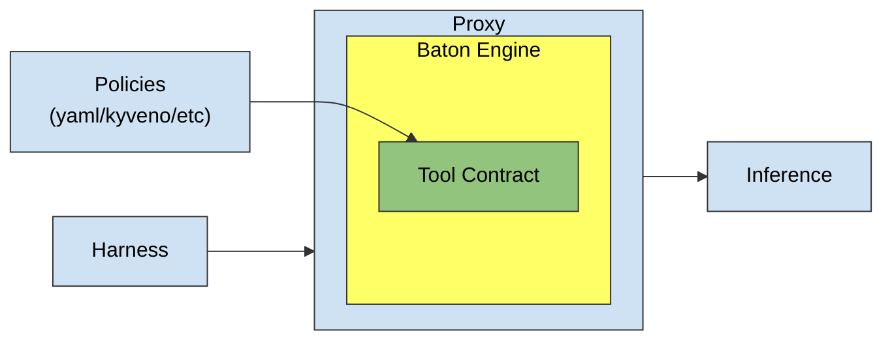

# Baton Spec v0

Baton is an information-flow policy engine for AI agents. It sits between the agent and its tools: every proposed flow — a tool call or an assistant message about to leave the mediation boundary — is checked before it happens. It tracks where information came from and decides whether it may flow into tools and external recipients.

# Glossary

**Engine**: evaluates proposed flows against registered policy in a given Trajectory and owns the registrations (tool contracts, transformers, action transitions, authorities, the response policy). Registries are fixed before the first evaluation.

**Trajectory** – one agent run: an append-only set of scoped facts (the event log) plus derived projections. Values, turns, actions, emissions, effects, grants, and audit are all facts or projections over them.

**Value** - one labeled, immutable datum in the trajectory (a user message, a model output, a tool result, a derived value). Every value carries a *Label* and full provenance, fixed at admission.

**Label** - the product of *dimensions* describing a value's information. A subject's effective label is a **projection over the facts causally relevant to it** — for a flow, the fold of its argument values and control dependencies (`L_flow = combine(L_args, L_control)`), never the whole conversation. (When the vision notes say labels "fold over the trajectory (causal)", this causal projection is what folds; an unrelated secret elsewhere in the trajectory MUST NOT taint the flow, but it taints everything derived from it, including the *choice* to act.)

**Dimension** - one axis of a *Label*. Each dimension defines its **combine** (the taint fold), its **adequacy** relation (the sink-side proof: holds / fails / unprovable), and its **widening** relation (the dual of adequacy: is one label strictly wider than a baseline). Dimensions are strictly separated and never combined with each other.

**Built-in dimensions:**

- **Trust**: trusted / suspicious / unknown. Combine keeps the worst evidence (min): suspicious dominates unknown, unknown dominates trusted.
- **Audience**: public / an explicit reader set / unknown. Combine is intersection: the result may be read only by those allowed to read every input.
- **Effects**: a set of {Mutation, Egress}, or unknown. Combine is union — an effect that happened stays in the trajectory.

(Attention — an explicit user confirmation — is a *requirement* a contract may demand of a flow, satisfied structurally by a confirming user turn; it is not a label dimension.)

**ToolContract** — a tool's annotation: Requirements the flow's label must satisfy before the call, the declared output label, and the tool's effects.

**Authority** - a registered principal (inline function or external approval round-trip) competent to grant exact, typed elevations. Authorities do exactly one kind of thing: rule on an *Authorization*.

**Transformer** - a registered function that derives a new value from an existing one under a declared, typically less restrictive label. The source value keeps its label; registration is a trust decision about the transformer, not a verification of its outputs.

**Remedy plan** - Baton's prediction for unblocking a soft-blocked flow: an ordered, non-empty list of remedies of exactly two kinds —

- **Reduce**: change the proposed flow so it fits the current authorization context. Typed targets: derive a value through a registered transformer, or narrow the pending action through a registered tool-identity transition (verified never wider).
- **Authorize**: grant the irreducible residual — an exact metadata delta at an exact scope: a durable derived value (minting a new value under the raised label; the source is never relabeled), one pending action (an acquired effect growth), or one policy check (a check-transient lift or an on-the-record acknowledgment of an unprovable fact).

A plan identifies the authorities competent for each Authorize step (prediction metadata; routing is resolved live at application). A plan is a prediction, never a permit.

# How Baton works

Baton does two things, and keeps them strictly separate:

**Propagation.** Every admitted value's label is computed at admission: caller-labeled only at ingress (the explicit trust boundary), the conservative fold of its dependency sets everywhere else. A flow's label is the causal projection `combine(L_args, L_control)` over exactly the values it depends on. Per dimension:

- Audience: intersection — only people allowed to read every input may read the result.
- Trust: worst wins — suspicious beats unknown, unknown beats trusted.
- Effects: union — once mutation or egress has happened, it stays.

**Checking.** Before a flow happens, its label is checked against the sink's requirements. Every well-formed proposal settles in exactly one of three outcomes, fail-closed:

- **Allowed now** — the checked flow satisfies policy; the caller receives a linear, revision-bound permit.
- **Remediable** — a soft block carrying a non-empty set of predicted remedy plans ("remediable with zero plans" is unrepresentable).
- **Terminal** — a proven claim: no available remedy can unlock the flow under the current policy and registered capabilities. The search is complete — there are no search bounds, so Terminal is never "nothing found within a budget".

An unprovable fact (an unknown label, an unregistered tool) is never accepted implicitly: it routes through the same remedy machinery as a breach — there is no deployment knob that downgrades "can't prove" to "allow". Invalid, stale, foreign, or conflicting proposals are **refusals** on a separate channel, outside the tri-state; a refusal touches no state. `NeedsApproval`, remedy failure, and remedy stall are continuations or resolution outcomes *within* a remediable flow, not additional policy outcomes.

Checks are based on Label algebra only — dimension propagation, adequacy, and widening; no bespoke branches. Two things are verified: (1) the flow's causal label satisfies the sink's requirements, and (2) **no-widening**: a declared output label wider than the causal input fold on any dimension is a violation remediable only by an explicit Authorize. Effects growth is the effects-axis instance of this check; on trust and audience, admission already computes every non-ingress label as the conservative fold (a declared-wider contract label is absorbed by the fold), so widening there is prevented by construction — an invariant, not a runtime branch.

**The response is a sink.** Any assistant output about to cross the mediation boundary is an emission flow through the same pipeline — same tri-state, same remedies, same permits. Core never infers that a turn is "final"; the caller presents an emission to the sink. Caller-labeled assistant ingress is unrepresentable in the API.

# Example

# Architecture



- **Blue** — NOT a part of baton itself. We provide a spec how to implement it and maybe an example implementation.
- **Yellow** — Baton itself.
- **Green** — Interface to extend/configure baton. We provide several examples.

# Spec

## How to integrate with your agent

Baton runs inside a proxy between the agent and its inference provider, or inside a tool gateway between the agent and its tools. The agent talks to the mediator as if it were the upstream API.

On each round-trip, the mediator:

1. **Admits the request.** Every turn not seen before is added to the Trajectory. External input (user messages, retrieved content) enters through ingress and MUST be labeled there. Tool results are recorded against the receipts of the calls they answer. Assistant output is admitted with its dependency sets — a mediator MUST NOT label assistant output itself.
2. **Forwards the request** to the provider unchanged.
3. **Checks every proposed flow.** Every tool call the model proposes is evaluated by the Engine before the agent sees it:
   - **Allowed now** — the call passes through; the mediator dispatches the canonical request rendered from the exact checked tree, and closes the action with the receipt.
   - **Remediable** — the mediator MAY walk a remedy plan (apply the head step; every application triggers a full recheck and returns a fresh outcome) and dispatch once a recheck allows.
   - **Terminal** — the mediator MUST NOT forward the call. It SHOULD return the block reason as a tool error, so the model can react (the soft block shifts the remedy choice to the model, as early as possible).
   - A **refusal** (stale, conflicting, unknown value) is a protocol error, not a policy outcome; the mediator SHOULD surface it as such.
4. **Checks the response.** Assistant text leaving the boundary MUST be presented to the emission sink and only the permitted rendering emitted. A blocked emission emits nothing and never clears a pending tool action.

The agent executes only tool calls that arrive in an inference response, and the user sees only renderings the emission sink permitted. A blocked flow never arrives, so it never happens.

## How to implement Baton

Baton is a type-first engine: everything is inferred and enforced through the type system. Permits (`ExecutionToken`, step capabilities, pending approvals) are linear values — non-cloneable, serialize-only, no public constructor, bound to trajectory + basis (+ flow/plan/step), spent on use. The `DispatchReceipt` is linear too but binds to the action's released lifecycle rather than the basis: it closes a dispatch that already happened, so an unrelated later fact (a checked emission, a new value) must not wedge the released action — permits authorize future state changes and stale; receipts record past ones and do not. Deserializing one would forge linearity, so none exists. Remedy plans returned for a soft block are the **irreducible nondominated frontier**: no plan has a removable step (removing any step breaks the predicted unlock), no plan is dominated by another that predicts the same resulting flow with a smaller authorization ask (typed partial orders per delta coordinate and scope; different asks are incomparable and both retained), and the serialization order is deterministic. Control-release rescue is size-first: the frontier carries every incomparable release of the smallest successful cardinality; a larger inclusion-minimal release with no successful proper subset is not enumerated (that would forfeit the early exit), while a fruitless search still sweeps the full lattice — exactly the Terminal proof. The consumer — model, harness, or human — picks from the frontier; core orders plans, not authorities.

## ALGEBRA

Trajectory state is one append-only algebra of scoped facts:

```text
L' = L ∪ { event }
combine = union
```

Every accepted event records its subject, fact, scope, issuer, and basis. Under the single-writer discipline the set is totally ordered, so union degenerates to ordered append with idempotent duplicate admission; a fact that contradicts the admitted lifecycle (a second release, a completion before release, a second consumption of a grant) is refused at admission. Facts only grow; nothing is ever removed.

Everything else is a projection:

- **Labels.** `Label(subject, L) = fold(relevant_events(subject, L))` — a value's label is recomputed from its admission facts (caller label at ingress, declared/raised label for transformed and endorsed values, the conservative dependency fold everywhere else); a flow's label is the causal projection over its argument and control facts.
- **Effects.** A proposal carries prospective effects; an action-scoped authorization may cover their growth without committing them. **Release appends the may-effect commitment before dispatch**; a declared failure appends a failure fact and never removes committed effects. The committed past is the projection over commitment facts.
- **Lifecycle.** Pending action and pending emission are projections over proposal/reduction/release/completion/failure facts; the impossible transitions are refused at event admission, which is the single enforcement point.
- **Grants.** Authority rulings are append-only facts: approval appends a grant, denial appends a denial (and never any availability). One-off authorization is a `GrantIssued` fact consumed by a `GrantConsumed` fact referencing the exact grant, check, and action — facts only grow, while the availability projection makes a consumed grant unavailable. A user confirmation is the same model: the confirming turn issues an implicit grant, spent by exactly one release.
- **Audit.** The audit log is a derived read model over the same facts — control-plane history, never a label field.
- **Revision.** The trajectory's revision is the digest of the event frontier. Every public mutation prevalidates, then appends one atomic batch; the frontier advances once per batch. Permits, plans, and approvals bind to the basis they were minted against, so **any later event stales everything minted before it**. Predicted plans live in a side cache bound to their basis and append nothing — predictions do not change policy state.

External acts still happen outside the algebra: authenticating an authority, running a transformer, dispatching a tool. Core validates their admission and immediately records accepted inputs and observed outcomes as facts.

## Example
